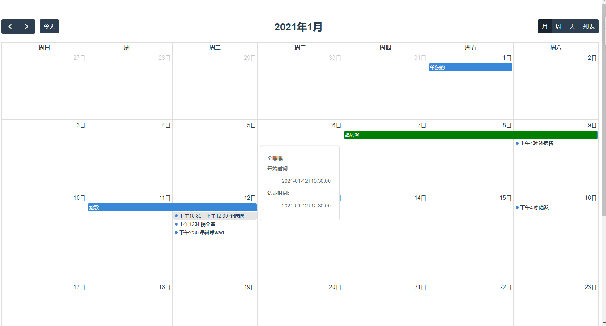

安装 
npm install --save @fullcalendar/core @fullcalendar/daygrid  
npm install --save @fullcalendar/interaction  
npm install --save @fullcalendar/timegrid  
npm install --save @fullcalendar/list  
 
官方文档
https://fullcalendar.io/docs/initialDate  
插件索引
https://fullcalendar.io/docs/plugin-index

特殊插件 tooltip提示插件   
tippy.js
npm i tippy.js

***图表 

